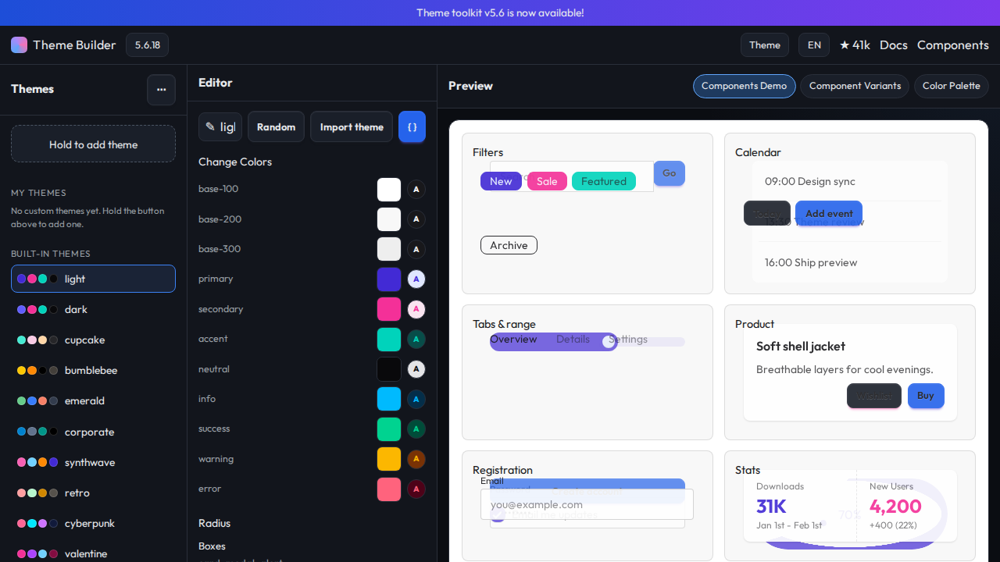

# CSS Theme Builder

This is the oracle implementation of the CSS Theme Builder reference app.
It features a vanilla JS core leveraging Vite, Tailwind 4.3.2, DaisyUI, and in-memory state persistence.
WebMCP tool bindings are included for programmatic interaction.

