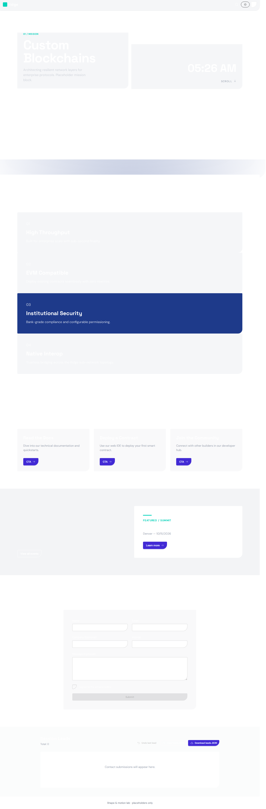

# Ridge L1 Network Marketing Landing Page

This is a complete React + Astro + Nano Stores application representing the Ridge Layer-1 network marketing site.

## Stack
- Astro (static delivery)
- React Islands
- Nano Stores (in-memory state management)
- Tailwind CSS 4.3.2 + DaisyUI
- GSAP + Lenis for animations

## Features
- Fully functional Events Manager with sorting, filtering, and bulk actions.
- Zod + React Hook Form validation for Event Create/Edit and Contact Lead forms.
- Export Catalog functionality (JSON, ICS) + Import capability.
- Session Leads log.
- Smooth scroll, sticky chapters, entrance animations.
- Dark/Light mode theme toggle.
- WebMCP Integration binding UI actions to exposed tools.

## Screenshot

